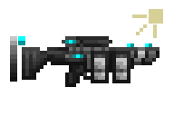

# Spriting

## What is this?

This section contains information about Monolith's art style. *It is not a guide for learning to sprite - there are a lot of better resources out there for that.*

## Guidelines

- Structures and most objects should use a 3/4 perspective.
    - Exemptions to this include things like guns, small items or other things that are impractical to draw with 3/4 perspective.
- Limit the amount of colors you use - Less is more. 
    - When possible, re-use colors from existing sprites.
    - Keep in mind the colors of the environment your sprite will be in.
- Lighting direction should come from the top-right when possible.
    - Some sprites may have their light source come from directly north.
    - Be tactical with lighter/darker sections of your sprite. It should feel realistic.
- Sprites should **never** use scaling in yaml.
    - (Almost) every single sprite in-game is 32x32 - larger sprites are expanded in 16x16 intervals. (Some special sprites may differ, but avoid doing so when possible!)
    - This is necessary to avoid ugly mixels.

## Tips

- Your first sprite will not be good. This is a fact of being an artist - Quality comes from practice. Keep going!
- NEVER use black outlines. They will look weird. Try using your darkest color instead, and lighten it up when appropriate. This will make the sprite look more realistic.
- Use dithering tactically. Avoid it when possible but sometimes its necessary to make something look good without using 30 colors.
- Don't put pixels together mindlessly. Think about what they represent and how they change the bigger picture.

## Examples

Figure 1. *The DEW Smilodon, a laser LMG*

The Smilodon, while not the the best example of a sprite with a constrained palette, is exemplary for gun shading.

TSFMC weapons, in general, are made up of dark polymer for most of the weapon, with cyan accents for scopes/sights and white/light gray parts on high tech weapons.

